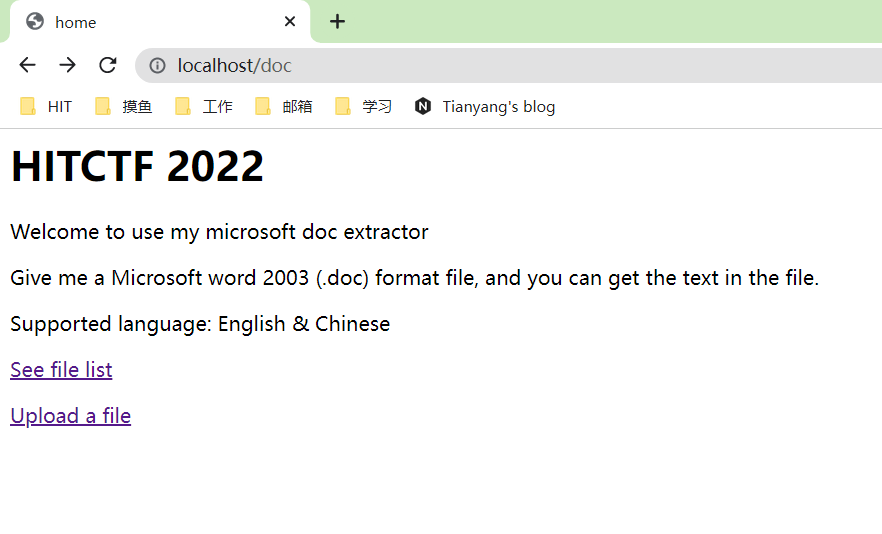
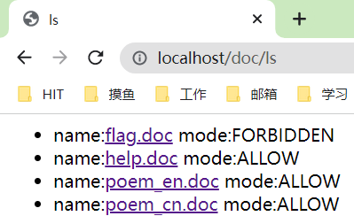
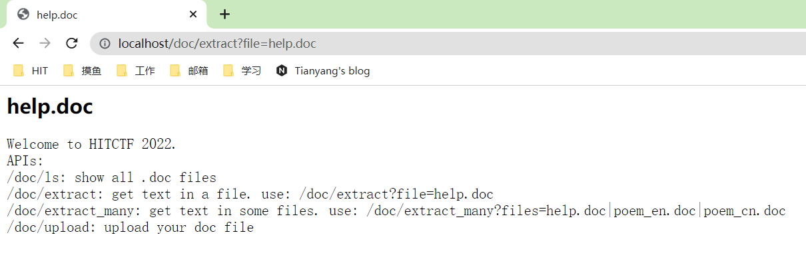
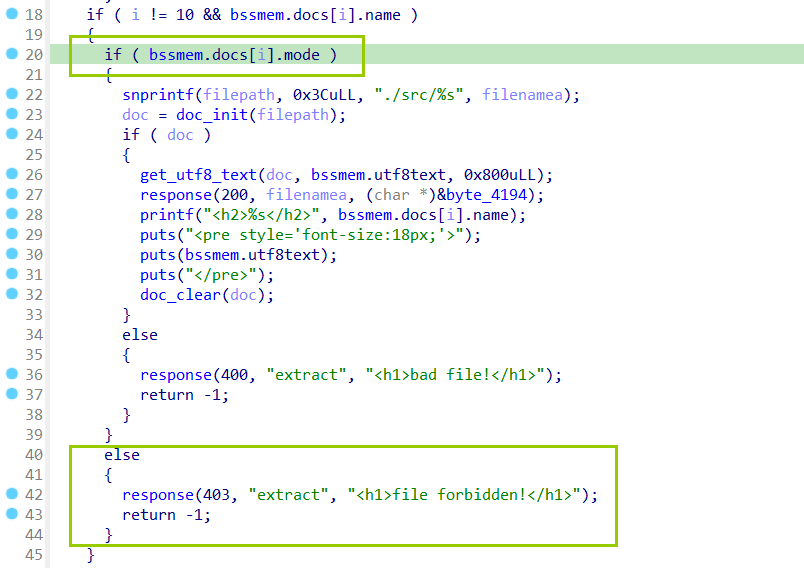

# doc

## 题目

本题给出了一个在线提取doc文件文字功能的web服务。

并且自带一些文档

`flag.doc`显示为禁止访问，其他的都可以查看。`help.doc`给出了web服务的所有api

## 攻击方法

分析后端程序，发现决定一个文件能否访问由mode位实现

执行extract时，文字会被输出到bss段上，并且`flag.doc`的mode位就在文字内容的下一位。

doc文档对中文等文字内容采用utf-16编码，程序将其转换为utf-8编码再输出。由于程序只支持中文、英文，因此默认了一个utf-8编码下的单个字符最多占3字节。在`strencodecpy`中，如果缓冲区空间剩下不到3字节就会停止输出，退出循环。

但实际上，utf-8编码下，存在占4字节的单个字符。例如一个emoji表情占4字节。程序将utf-16编码的字符转换为utf-8时，也正确地转换了这些占4字节的字符，就提供了`strencodecpy`中向下溢出的可能性。我们可以构造这样一种情况: `strencodecpy`函数中执行到缓冲区剩余3字节，再提供一个占四字节的字符，从而向下溢出修改`flag.doc`的mode位。

为此，我们先用word生成一个合法的doc文档。注意到程序中文字内容长度限制为2048字节，我们向文档中写入一段用utf-8编码占2045字节的文字。为了让文档的编码格式为utf-16而不是ascii，我们需要在文档中输入一些中文。我们输入681个中文字符，再加上两个英文字符(例如'aa')，将文档保存。

之后我们用010 editor等工具打开刚刚的文档，找到我们输入的文字内容。我们字符串'aa'在utf16编码下为`\x61\x00\x61\x00`，我们可以通过搜索这4字节内容来快速定位到文字串末尾。之后，我们修改之后的4字节内容，将其改为一个emoji表情的utf16编码。例如，"😄"的编码是`\x3d\xd8\x04\xde`。这样我们就构造好了我们的`exp.doc`

把`exp.doc`传上去，然后在`extract_many`中先解`exp.doc`再解`flag.doc`就可以拿到flag

## exp

把`exp.doc`传上去，然后访问`/doc/extract_many?files=user0.doc|flag.doc`
